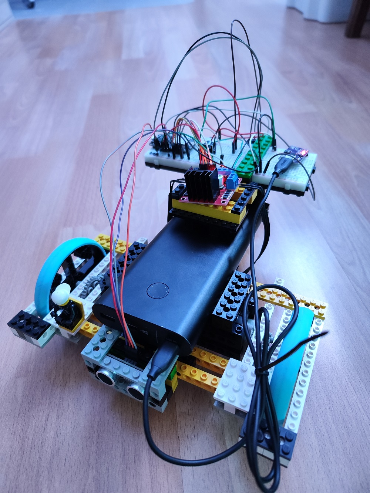

# Welcome to ESP-Robot written in Micropython

***
## Requirements specification:
1. ESP Microcontroller
2. Chassis
3. DC Motors
4. Motor Driver
5. Battery
6. Light (wb2812b)
7. Sound (R2D2 Sounds)
8. the PROGRAMM
***
## 1. ESP Microcontroller
The Robot is programmed in Micropython. So need a Microcontroller with supported Micropython.
Here is a list with supported hardware from micropython:
https://micropython.org/download/
Recommended:
- ESP32
Please look, how much PINs can use with micropython
***
## 2. Chassis
Yes, there are a lot of chassis on the market here. If you look closer, they are only made of sheet metal or fall apart just by looking at them. A modular base is needed - Lego!
The Robot is designed with Studio 2.0, here is the download link:
https://www.bricklink.com/v3/studio/download.page
***
## 3. DC Motors
Of course, since the chassis is based on Lego, it's smart to use Lego motors.
2x Power Functions L
Here is the link:
https://www.bricklink.com/v2/catalog/catalogitem.page?S=88003-1
***
## 4. Motordriver
In any case, the L298N motor driver. It is widely used and you can find information about it in case of errors.
Can find at many webstores, it cost arround 4$
***
## 5. Battery
Let's think about the Battery, easy to use, easy to charging, not dangerous - a power bank !
Important is, that the powerbank have the power delivery. With this, can give the the motor controller more juice.
***
## 6. Light
The Robot defentily need some lights. "A robot needs a light to help it see in the dark, just like how humans need a flashlight!"
So the Robot get some wb2812b LEDs, easy to use and found much in the network. The ESP Robot have a 3 LEDs Strip wb2812b.
***
## 7. Sound
Beeeep, Bep, Sound. It's very easy to you a piezo buzzer for make some R2D2 noises.
Some small piezo buzzer are avaiable in all electronic onlinestores.
***
## 8. the PROGRAMM
Is the heart of the Robot, without, it's can do nothing!
For some month i learned Python, and so i programmed it in Micropython.
Boot.py with Wifi-SSiD and Wifi-Password
Main.py with the html website, Motor Speed, Automatic drive (in the earlist Version)
***
## 9. Hardware
wiring und power delivering
////// make wiring in fritzwiring or something
***
## 10. ESP Robot Self-Driving Logic
What does the ESP Robot do? Forward, 35cm, Stop, Back, Left or Right, Forward again
some good links and thinkings:
braitenberg-vehikel

## To-Do's and everything:
- [ ] new microcontroller ESP32-S2
- [ ] new models of the Lego Chassis
- [ ] Programming it better
- [ ] add some sensors
